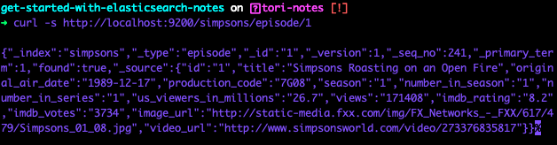
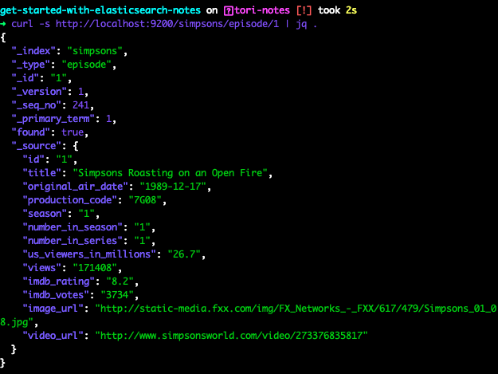

# [01. Get Data From Elasticsearch by id Using HTTP](https://egghead.io/lessons/elasticsearch-get-data-from-elasticsearch-by-id-using-http)

## Basic HTTP GET Request Using `id`

We use the `curl` command to execute a `HTTP GET` request against the Elasticsearch cluster to receive documents. 

```bash
$ curl -s http://localhost:9200/simpsons/episode/1
```

The result of this HTTP request is a JSON object.



Will mentions here that the JSON object looks messy in the terminal and refers to the terminal tool `jq` which is a lightweight command-line JSON processor. If you don't already have `jq` downloaded on your machine, you can do so [here](https://stedolan.github.io/jq/download/). Then run 

```bash
$ curl -s http://localhost:9200/simpsons/episode/1 | jq .
```

to recieve a neat and easily readable JSON object in the terminal.



Within this JSON response we have the document `_id` and `_version`. The `_version` is automatically incremented anytime the document is updated within Elasticsearch. We also have the `found` object which has a `boolean` value and represents whether the document exists within the Elasticsearch cluster. 

The `_source` object within the JSON response often houses the bulk of the information we're normally looking for when creating the HTTP request. In this case, it is details (episode title, original air date, etc.) about the specific Simpsons episode that we requested.

If we only wanted to receive the episode details found within the `_source` object and nothing else, we can add `/_source` to the end of our HTTP request:

```bash
$ curl -s http://localhost:9200/simpsons/episode/1/_source | jq .
```

## Adding Query String Parameters

We can add query string parameters to exclude specific fields, such as the `video_url`, by adding the `_source_excludes=` parameter. This request would look like the following:

```bash
$ curl -s http://localhost:9200/simpsons/episode/1/_source?_source_excludes=video_url | jq .
```

We can even go a step further and exclude multiple parameters at once by using a comma:

```bash
$ curl -s http://localhost:9200/simpsons/episode/1/_source?_source_excludes=video_url,production_code,image_url | jq .
```

Alternatively, we could use the `_source_includes=` parameter to only receive the specific fields that we want. For example, let's only grab the `id`, `title`, `season` and `original_air_date`:

```bash
$ curl -s http://localhost:9200/simpsons/episode/1/_source?_source_includes=id,title,season,original_air_date | jq .
```

*Quick Note: In the video, Will uses `_source_exclude=` and `_source_include=` instead of `_source_exludes=` and `_source_includes=`. This is a small change that has been made since the creation of the course.*

Will notes at the end of the video that there are many other parameters that can be used alongside the `HTTP GET` request. I've added the link to the updated Elasticsearch documentation he mentioned below.

### Resources

[Get API - Elasticsearch Reference [7.6]](https://www.elastic.co/guide/en/elasticsearch/reference/7.6/docs-get.html)