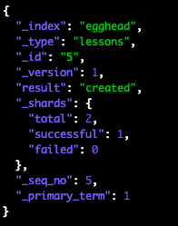

# [03. Add Data to Elasticsearch](https://egghead.io/lessons/tools-add-data-to-elasticsearch)

Adding or saving data to Elasticsearch is referred to as <b>indexing</b>.

## Adding Data

In order to save data to Elasticsearch, we can run a `curl` command in our terminal. 

```bash
$ curl -XPUT -H 'Content-type: application/json' -d '{"title": "Add data to Elasticsearch", "summary": "Learn to index into Elasticsearch", "views": "10000"}' localhost:9200/egghead/lessons/5
```

*Quick side note: as of Elasticsearch 6.0, we must include content-type headers in Elasticsearch REST requests. See [here](https://www.elastic.co/blog/strict-content-type-checking-for-elasticsearch-rest-requests) to learn more about this change.*

The JSON response to the above command should resemble this:



Take note of `"result": "created"` which represents that the data at index of 5 was just created.

## Accidentally Overriding Data

Now there is the possibility of overriding saved data to Elasticsearch. This can accidentally be done by saving data to an index that already exists with data. A good indicator that this has happened is by looking at `"result"` and `"_version"` within the JSON response. Instead of saying `"result": "created"` this time it will say `"result": "updated"` and if the `"_version"` is above 1, that means that there has been an update to the data.

If this is done, that data is lost forever. OH NO! Will goes on to explain that there are two ways to avoid this major oops.

## How to Avoid Overriding Data

### Check Specific Index

One way to avoid overriding data is to check if data exists at a specific index by running 

```bash
$ curl -i http://localhost:9200/egghead/lessons/5
```

With this, we'll either receive an `HTTP 200` response back (successful -- the data exists) or  we'll receive an `HTTP 404` response (unsuccessful -- the document doesn't exist). While this is doable when working on smaller projects, it isn't resonable to use when working with a high volume system. 

### Using Query Parameters and API Endpoints

Using `op_type` (query parameter) or `_create` (API endpoint) will only index the document if it doesn't already exist which makes them the optimal choice when working with high volume systems. If a document with the `_id` we are trying to use already exists, then the operation will fail and we'll receive an `HTTP 409` error. If it doesn't exist, we'll receive an `HTTP 201` response and our document will have been indexed.

`?op_type`
```bash
$ curl -XPUT -H 'Content-type: application/json' -d '{"title": "Error handling in Elasticsearch", "summary": "Error handling is for wimps", "views": "1000"}' 'localhost:9200/egghead/lessons/5?op_type=create'
```

`_create`
```bash
$ curl -XPUT -H 'Content-type: application/json' -d '{"title": "Error handling in Elasticsearch", "summary": "Error handling is for wimps", "views": "1000"}' localhost:9200/egghead/lessons/5/_create
```

*Both of the above commands will return a `HTTP 409` error.*

### Resources

[String Content-Type Checking for Elasticsearch REST Requests](https://www.elastic.co/blog/strict-content-type-checking-for-elasticsearch-rest-requests)
<br>
[Index API](https://www.elastic.co/guide/en/elasticsearch/reference/current/docs-index_.html)
